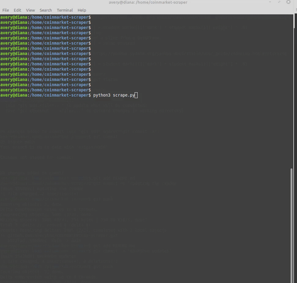

# Crypto Data Collector

`coinmarketcap-scraper` is an application that easily lets you pull all the relevant data from *[Coinmarketcap](coinmarketcap.com)*, a cryptocurrency website that displays **up-to-date** information about all things crypto. 
- Which pieces of data does this pull:
    - Crypto name
    - Nickname
    - Price
    - Daily Percent
    - Weekly Percent
    - Market Cap
    - Volume
    - Circulating Supply
     
With this tool, you will be able to talk with others about currencies more than just Bitcoin and Dogecoin, congrats!

## How does this work?

I used the Python scraping library *[BeautifulSoup](https://beautiful-soup-4.readthedocs.io/en/latest/)* to pull the data from Coinmarketcap. I used another library called *[Pyppeteer](https://pyppeteer.github.io/pyppeteer/)* that acts as a headless chrome browser in order to scroll the site for me. 

- Why do I need pyppeteer to scroll the website for me though?

At first glance, <https://coinmarketcap.com> is a regular site. All you need is to find the appropriate class name within the HTML and pull the data, right? Wrong. Coinmarketcap is a *dynamically loading* site, or lazy loading site. All the information appears to be on the webpage, but in the background, it actually is not all there. It loads when you scroll down, but BeautifulSoup, or even getting the html contents with a simple 

```wget coinmarketcap.com```

won't show all the data you want. I was only getting the full data from the top 10 crypto's - versus the top 100 on the front page that I wanted.

Pyppeteer solved the problem for me. It is the 'virtual' keyboard that scrolls the site to load all the data, from there BeautifulSoup comes in and does their work, parsing and finding the data. To see Pyppeteer in action, setting  


```browser = await launch()```

in the *scrape.py* file to

```browser = await launch(headless = False)```

will show you the scrolling.





From there, I used *[Pandas](https://pandas.pydata.org/)* to convert all data into one DataFrame, and then export to a nice and neat csv file.


## How can I use it?

Running the **scrape.py** file will get the csv file outputted into the same directory you are running the code in.

The **csv_to_db.py** will be inserting values into a database, if it exists. 


### License

Copyright (c) 2021 Avery Grace Bostick
Licensed under the MIT license.